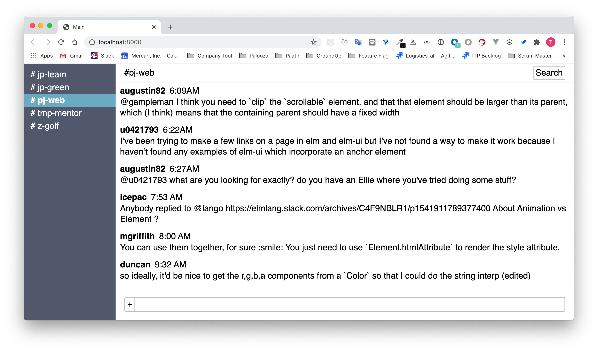

# Build slack UI using elm-ui



## Prerequisite

- Install Elm

```shell
npm install -g elm
```

- Install `elm-live`

```shell
npm install -g elm-live
```

## Launch

```shell
elm-live src/Main.elm --open
```
